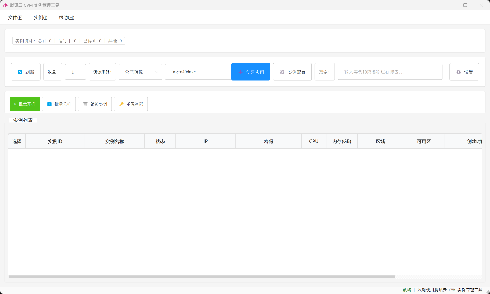
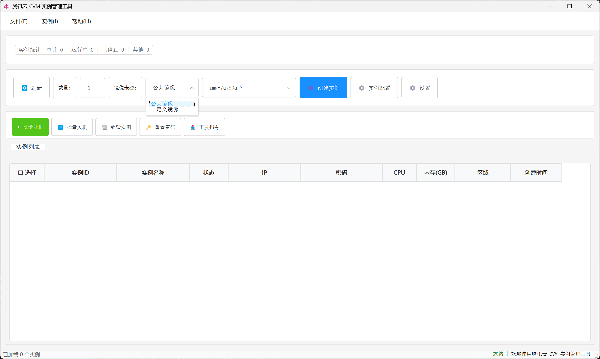
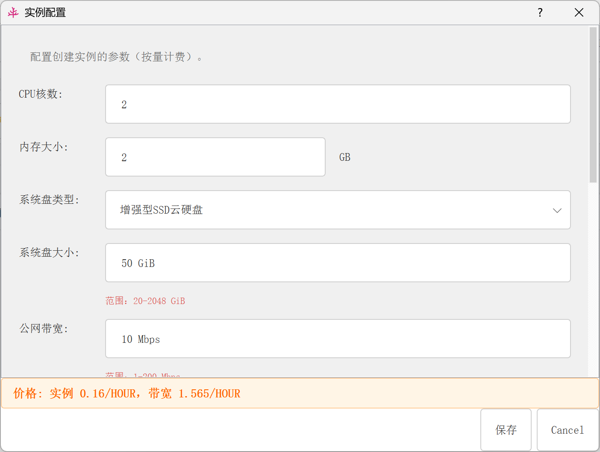

# 腾讯云 CVM 实例管理工具

基于腾讯云 APIv3.0 的桌面图形工具，支持批量管理与创建 CVM 实例（公共镜像/自定义镜像）。

## 主要功能
- 实例创建：公共镜像（用实例配置中的镜像 ID）或自定义镜像（自动拉取账号下私有镜像列表）
- 批量操作：开机、关机、销毁、重置密码
- 密码重置行为：运行中实例会被强制关机，重置完成后自动开机；已关机实例保持关机
- 实例列表：展示状态/IP/配置，密码支持显示/隐藏与复制
- 配置管理：界面可保存默认 CPU/内存/区域/公共镜像/密码，启动时自动读取；无公共镜像时创建按钮禁用
- 日志与提示：界面消息提示，`cvm_manager.log` 记录关键操作

## 主要功能界面




## 环境要求
- Python 3.8+（推荐 3.10+）
- 腾讯云账号与 API 密钥（SecretId、SecretKey）
- 依赖：PyQt5、tencentcloud-sdk-python 等（见 `requirements.txt`）

## 安装
```bash
pip install -r requirements.txt
```

## 配置API凭证与默认参数
- 方式一：首次启动会生成/校验配置文件，可在“设置”中添加相关凭据并保存
- 方式二：使用环境变量
  - Windows PowerShell: `set TENCENT_SECRET_ID=xxx`，`set TENCENT_SECRET_KEY=xxx`
  - Linux/macOS: `export TENCENT_SECRET_ID=xxx`，`export TENCENT_SECRET_KEY=xxx`

## 启动图形界面
```bash
python main.py
```

## 界面操作要点
- 设置：录入 API 凭证
- 实例配置：设置默认 CPU/内存/区域/公共镜像 ID/密码
- 镜像来源选择：公共镜像（用实例配置镜像）或自定义镜像（从账号私有镜像列表选择，选择后实例配置按钮会禁用）
- 刷新：拉取实例列表
- 创建实例：按当前镜像来源和数量创建；无可用镜像时按钮会禁用
- 批量开机 / 关机 / 销毁
- 批量重置密码：运行中实例会强制关机，重置完成后自动开机；关机实例仅重置密码

## Python 代码示例
```python
from core.cvm_manager import CVMManager

# 使用 config_manager 时，可传入 None 自动读取配置文件
manager = CVMManager(None, None, None)

# 创建实例（单台）
manager.create(
    cpu=2,
    memory=4,
    region="ap-beijing",
    password="YourPassword123!",
    image_id=None,
    instance_name="demo",
    zone=None,
    count=1
)

# 获取实例列表
instances = manager.get_instances(None)

# 批量开机/关机
ids = [i["InstanceId"] for i in instances[:2]]
manager.start(ids)
manager.stop(ids, force=False)

# 重置密码（运行中会强制关机并在完成后自动开机）
manager.reset_pwd(ids, "NewPassword123!")

# 销毁实例
manager.terminate(ids)
```

## 行为与限制说明
- 密码复杂度按腾讯云官方规则校验（Linux/Windows 规则差异已处理）
- 重置密码：运行中实例 ForceStop 后重置并自动开机；关机实例不自动开机
- 批量操作数量受腾讯云 API 限制（通常 100 台/次）
- 创建实例需满足账户余额与配额

## 项目结构
```
txCloudCVMCract/
├── README.md
├── requirements.txt
├── main.py                  # 启动 GUI
├── config/
│   ├── config.py
│   └── config_manager.py    # 读取/保存默认参数与凭证
├── core/
│   └── cvm_manager.py       # 核心 API 封装
├── ui/
│   ├── app.py
│   ├── main_window.py
│   ├── dialogs/
│   │   ├── password_dialog.py
│   │   └── instance_config_dialog.py
│   └── components/
│       ├── instance_list.py
│       └── message_bar.py
├── utils/
│   └── utils.py
└── examples/
    ├── create_instance.py
    └── batch_operations.py
```

## 注意事项
- 妥善保管 API 密钥，建议使用子账号并配置最小权限
- 关注实例费用，按需关机或销毁；地域与规格价格可能不同
- 遇到问题可查看 `cvm_manager.log` 日志排查

## 许可证
MIT


