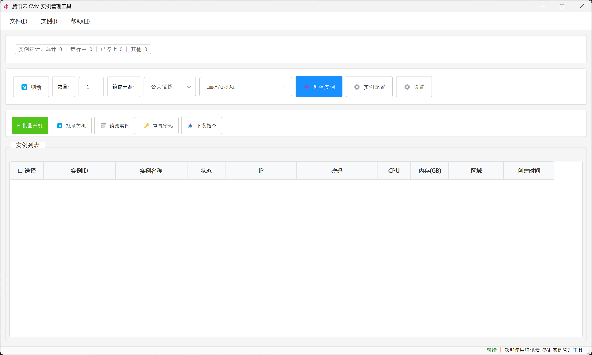
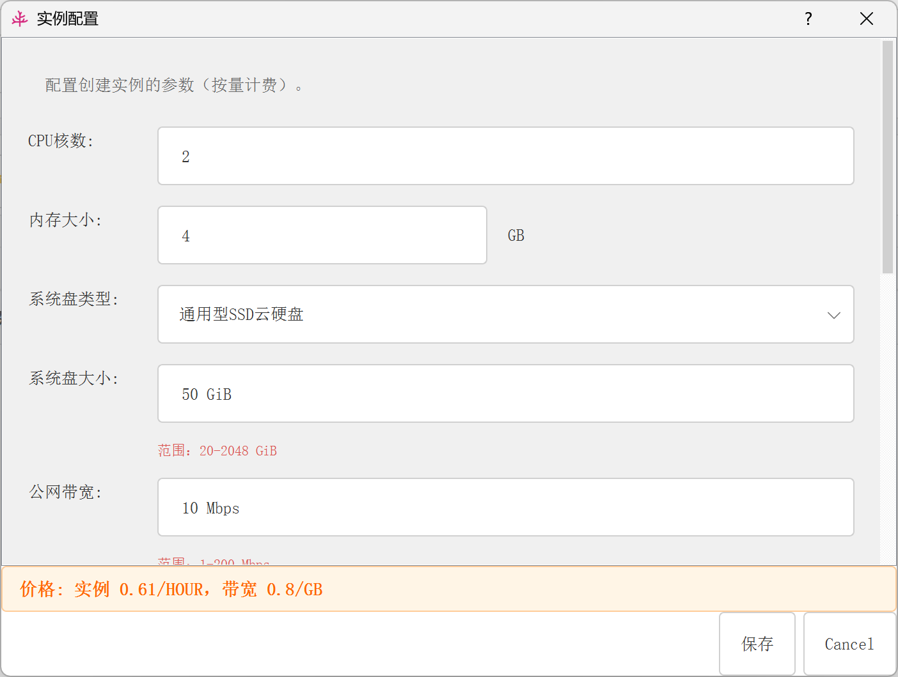

# 腾讯云 CVM 实例管理工具

基于腾讯云 APIv3.0 的桌面图形工具，支持批量管理与创建 CVM 实例（公共镜像/自定义镜像）。

## 主要功能
- **实例创建**：公共镜像（用实例配置中的镜像 ID）或自定义镜像（自动拉取账号下私有镜像列表）
- **批量操作**：开机、关机、销毁、重置密码、下发指令
- **下发指令**：基于腾讯云 TAT（自动化工具）API，支持向 Linux/Windows 实例批量下发命令
  - 支持从本地文件读取指令内容
  - 自动识别实例操作系统类型（Linux/Windows）
  - 自动设置命令类型和工作目录
  - 实时监控指令执行状态
- **密码重置行为**：运行中实例会被强制关机，重置完成后自动开机；已关机实例保持关机
- **实例列表**：展示状态/IP/配置，密码支持显示/隐藏与复制
- **配置管理**：界面可保存默认 CPU/内存/区域/公共镜像/密码，启动时自动读取；支持更新配置信息（区域、可用区、镜像）
- **异步操作**：所有批量操作采用异步处理，不阻塞界面，实时反馈操作状态
- **日志与提示**：界面消息提示，`cvm_manager.log` 记录关键操作

## 主要功能界面





## 环境要求
- Python 3.8+（推荐 3.10+）
- 腾讯云账号与 API 密钥（SecretId、SecretKey）
- 依赖：PyQt5、tencentcloud-sdk-python 等（见 `requirements.txt`）

## 安装
```bash
pip install -r requirements.txt
```

## 配置API凭证与默认参数
- 方式一：首次启动会生成/校验配置文件，可在“设置”中添加相关凭据并保存
- 方式二：使用环境变量
  - Windows PowerShell: `set TENCENT_SECRET_ID=xxx`，`set TENCENT_SECRET_KEY=xxx`
  - Linux/macOS: `export TENCENT_SECRET_ID=xxx`，`export TENCENT_SECRET_KEY=xxx`

## 启动图形界面
```bash
python main.py
```

## 界面操作要点
- **设置**：录入 API 凭证
- **实例配置**：设置默认 CPU/内存/区域/公共镜像 ID/密码
  - 支持"更新配置信息"功能，可刷新区域、可用区、镜像数据
- **镜像来源选择**：公共镜像（用实例配置镜像）或自定义镜像（从账号私有镜像列表选择，选择后实例配置按钮会禁用）
- **刷新**：拉取实例列表
- **创建实例**：按当前镜像来源和数量创建；无可用镜像时按钮会禁用
- **批量操作**：
  - **批量开机**：自动过滤已运行实例，仅对需要开机的实例执行操作
  - **批量关机**：自动过滤已停止实例，仅对需要关机的实例执行操作
  - **批量销毁**：销毁选中的实例
  - **批量重置密码**：运行中实例会强制关机，重置完成后自动开机；关机实例仅重置密码
  - **下发指令**：
    - 选择需要下发指令的实例（必须为同一操作系统类型）
    - 在对话框中输入指令内容，或点击"选择文件"从本地文件读取
    - 支持 Linux（SHELL）和 Windows（POWERSHELL）命令
    - 系统自动识别实例类型并设置相应的命令类型和工作目录

## Python 代码示例
```python
from core.cvm_manager import CVMManager

# 使用 config_manager 时，可传入 None 自动读取配置文件
manager = CVMManager(None, None, None)

# 创建实例（单台）
manager.create(
    cpu=2,
    memory=4,
    region="ap-beijing",
    password="YourPassword123!",
    image_id=None,
    instance_name="demo",
    zone=None,
    count=1
)

# 获取实例列表
instances = manager.get_instances(None)

# 批量开机/关机
ids = [i["InstanceId"] for i in instances[:2]]
manager.start(ids)
manager.stop(ids, force=False)

# 重置密码（运行中会强制关机并在完成后自动开机）
manager.reset_pwd(ids, "NewPassword123!")

# 下发指令（需要实例安装 TAT Agent）
result = manager.run_command(
    instance_ids=ids,
    command_content="ls -l /root",
    command_type="SHELL",
    working_directory="/root",
    timeout=60,
    username="root"
)
invocation_id = result["InvocationId"]

# 查询指令执行结果
tasks = manager.describe_invocation_tasks(invocation_id=invocation_id)
for task in tasks["InvocationTaskSet"]:
    print(f"实例 {task['InstanceId']}: 状态={task['TaskStatus']}, 退出码={task['TaskResult']['ExitCode']}")

# 销毁实例
manager.terminate(ids)
```

## 行为与限制说明
- **密码复杂度**：按腾讯云官方规则校验（Linux/Windows 规则差异已处理）
- **重置密码**：运行中实例 ForceStop 后重置并自动开机；关机实例不自动开机
- **批量操作**：
  - 批量操作数量受腾讯云 API 限制（通常 100 台/次）
  - 自动过滤已处于目标状态的实例，避免重复操作
  - 所有操作采用异步处理，实时反馈状态
- **下发指令**：
  - 实例必须安装 TAT Agent 才能使用下发指令功能
    - 注意：腾讯云的新版公共镜像通常已预装 TAT Agent
    - 如果使用旧镜像或自定义镜像，可能需要手动安装
  - 实例必须处于 RUNNING 状态
  - 实例必须处于 VPC 网络
  - 同时只能对单一操作系统类型（Linux 或 Windows）的实例下发指令
  - 支持从本地文件读取指令内容
- **创建实例**：需满足账户余额与配额

## 项目结构
```
txCloudCVMCract/
├── README.md
├── requirements.txt
├── main.py                  # 启动 GUI，预加载区域/可用区/镜像数据
├── config/
│   └── config_manager.py    # 读取/保存默认参数与凭证
├── core/
│   └── cvm_manager.py       # 核心 API 封装（CVM + TAT）
├── ui/
│   ├── app.py               # 主应用窗口
│   ├── main_window.py       # 主界面逻辑
│   ├── dialogs/
│   │   ├── settings_dialog.py          # 设置对话框
│   │   ├── instance_config_dialog.py   # 实例配置对话框
│   │   └── send_command_dialog.py     # 下发指令对话框
│   └── components/
│       ├── instance_list.py            # 实例列表组件
│       └── message_bar.py              # 消息提示条
├── utils/
│   ├── db_manager.py        # SQLite 数据库管理
│   └── utils.py             # 工具函数
└── API说明文档/
    ├── 创建命令.txt
    ├── 执行命令.txt
    └── 查询执行任务.txt
```

## 注意事项
- **API 密钥安全**：妥善保管 API 密钥，建议使用子账号并配置最小权限
- **费用管理**：关注实例费用，按需关机或销毁；地域与规格价格可能不同
- **TAT Agent**：
  - 腾讯云的新版公共镜像通常已预装 TAT Agent，可直接使用下发指令功能
  - 如果实例未安装 TAT Agent（会提示错误），需要手动安装：
    - Linux：执行安装脚本 `bash tat_agent_install.sh`
    - Windows：从腾讯云控制台下载并安装
  - 本项目不会自动安装 TAT Agent，依赖镜像本身是否包含
- **日志排查**：遇到问题可查看 `cvm_manager.log` 日志排查
- **异步操作**：批量操作采用异步处理，操作完成后会自动更新实例状态

## 许可证
MIT


