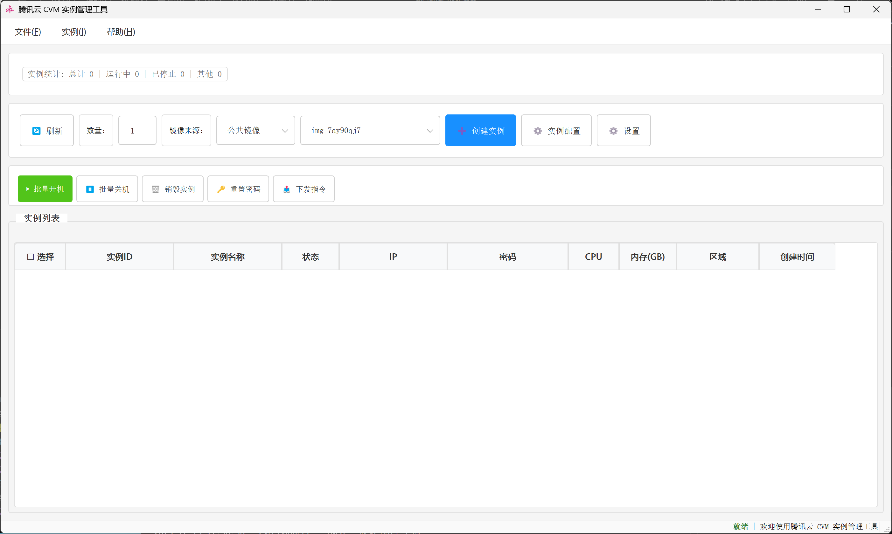
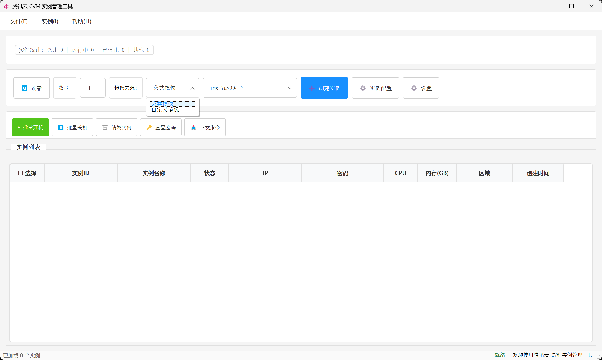
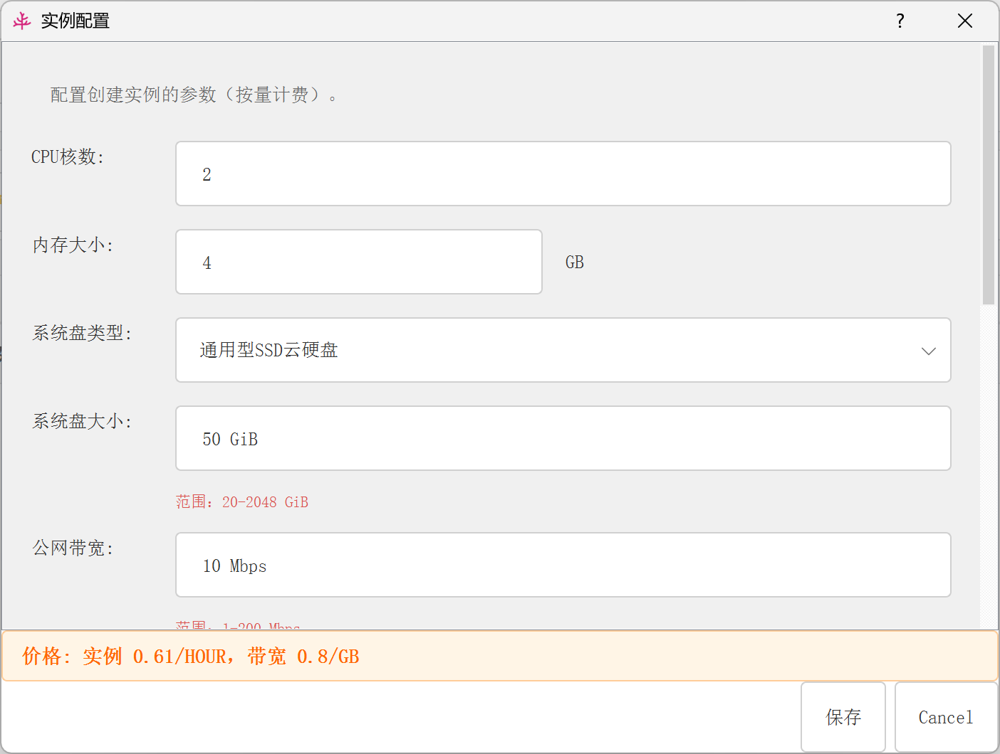
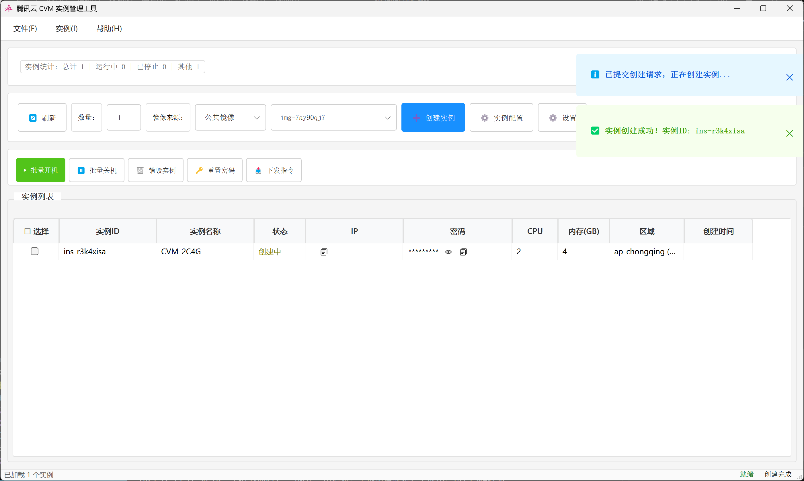
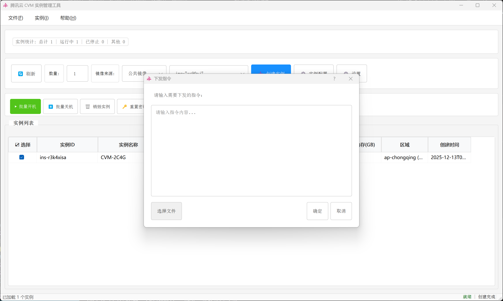

# 腾讯云 CVM 实例管理工具

基于腾讯云 API v3 的 PyQt5 桌面图形工具，用于管理和批量创建 CVM 实例。内置 Go 高并发预加载服务，实现区域、可用区、镜像、实例数据的快速同步与本地缓存。

## 主要功能

### 实例创建与管理
- **双镜像来源**：公共镜像（按平台分类筛选，支持 Debian、Ubuntu、CentOS、Windows 等 13 种平台）或自定义镜像（自动拉取账号下私有镜像列表）
- **批量创建**：一键创建 1–100 台实例，支持自定义 CPU / 内存 / 磁盘 / 带宽参数
- **实时询价**：实例配置对话框中修改参数后自动计算价格

### 批量操作
- **批量开机 / 关机 / 销毁**：对选中实例一键操作
- **批量重置密码**：运行中实例先关机再重置并自动开机；已关机实例仅重置密码
- **下发指令**：基于腾讯云 TAT API，向 Linux / Windows 实例批量下发命令
  - 支持手动输入或从本地文件读取指令内容
  - 自动识别实例操作系统，设置命令类型（SHELL / POWERSHELL）和工作目录
  - 实时监控指令执行状态

### 实例列表
- 展示实例 ID、名称、状态（彩色标识）、IP、CPU、内存、区域、创建时间
- 实例 ID 和 IP 支持一键复制
- **密码管理**：每台实例独立存储密码，支持显示 / 隐藏切换与一键复制
- 表头全选 / 取消全选复选框

### 配置与缓存
- **设置对话框**：录入 API 凭证（SecretId / SecretKey），支持在线验证有效性
- **实例配置对话框**：保存默认 CPU / 内存 / 区域 / 可用区 / 磁盘类型与大小 / 带宽 / 镜像等参数
- **数据缓存**：区域、可用区、镜像列表通过 Go 服务同步到本地 SQLite，离线时可使用缓存数据

### 其他
- **全异步**：所有网络操作在后台线程执行，不阻塞界面
- **自动刷新**：定时同步云端实例到本地，定时轮询本地缓存刷新 UI
- **异常容错**：网络抖动或回调异常不会导致程序崩溃
- **日志**：界面顶部消息栏实时提示，`cvm_manager.log` 记录关键操作

## 界面截图

| 主界面 | 主界面（实例列表） |
|:---:|:---:|
|  |  |

| 设置 | 实例配置 | 下发指令 |
|:---:|:---:|:---:|
|  |  |  |

## 环境要求
- Python 3.8+（推荐 3.10+）
- 腾讯云账号与 API 密钥（SecretId、SecretKey）
- 依赖：PyQt5、tencentcloud-sdk-python、requests（见 `requirements.txt`）
- Go 1.20+（可选）：仅在需要自行编译预加载服务时使用；仓库已包含编译好的 `go_preload_server.exe`

## 快速开始

### 1. 安装依赖
```bash
pip install -r requirements.txt
```

### 2. 启动程序
```bash
python main.py
```

### 3. 配置 API 凭证
首次启动后，点击工具栏「设置」按钮，填写腾讯云 API 凭证并保存。

也可通过环境变量预配置：
```powershell
# Windows PowerShell
$env:TENCENT_SECRET_ID = "xxx"
$env:TENCENT_SECRET_KEY = "xxx"
```
```bash
# Linux / macOS
export TENCENT_SECRET_ID=xxx
export TENCENT_SECRET_KEY=xxx
```

## 启动流程

```
main.py 启动
  ↓ ensure_config_file() — 自动创建数据库与默认配置
  ↓ 显示加载窗口（带点动画）
  ↓ 后台线程启动 Go 预加载服务
  ↓ Go 服务并发拉取区域 / 可用区 / 镜像 / 实例，写入 SQLite
  ↓ 预加载完成 → 关闭加载窗口，主界面从 SQLite 读取数据
```

- 首次运行时 `data/cvm_cache.db` 会自动创建，无需手动操作
- 预加载失败时程序仍可正常启动，使用已有缓存数据

## Go 预加载服务

内置的 Go HTTP 服务负责高并发数据同步：

- 并发调用腾讯云 API：`DescribeRegions` / `DescribeZones` / `DescribeImages`（分页遍历）/ `DescribeInstances`
- 数据直接写入本地 SQLite（WAL 模式）
- HTTP 接口：
  | 路径 | 说明 |
  |------|------|
  | `/health` | 健康检查 |
  | `/preload_all` | 一次性同步全量数据到 SQLite |

Python 侧职责：
- 通过 HTTP 触发 Go 服务的 `/preload_all` 完成数据同步
- 从 SQLite 读取缓存数据刷新 UI
- 实例创建 / 开关机 / 销毁 / 重置密码 / 下发指令等操作直接调用腾讯云 SDK（不依赖 Go）

### 自行编译 Go 服务（可选）

仓库已包含编译好的可执行文件。如需重新编译（需 Go 1.20+）：

```bash
cd go_preload
go build -o go_preload_server.exe main.go
```

> **没有 Go 服务时：** 程序可正常启动，已有缓存时使用旧数据，首次无缓存时列表为空。实例操作功能不受影响。

## 数据安全

- **API 凭据**存储在本地 SQLite 数据库中，不随代码提交（`data/`、`*.db` 已在 `.gitignore` 中排除）
- **实例密码**以明文存储在本地数据库，仅用于界面展示和复制，不会上传
- 运行时环境变量（`TENCENT_SECRET_ID` / `TENCENT_SECRET_KEY`）仅在当前进程有效

## 行为与限制
- **密码复杂度**：按腾讯云官方规则校验（Linux / Windows 规则差异已处理）
- **批量操作**：数量受腾讯云 API 限制（通常 100 台/次），自动过滤已处于目标状态的实例
- **下发指令**：实例需安装 TAT Agent 且处于 RUNNING 状态；新版公共镜像通常已预装
- **创建实例**：需满足账户余额与配额

## 项目结构

```
├── main.py                  # 程序入口
├── config/
│   └── config_manager.py    # 配置管理（读写 SQLite）
├── core/
│   ├── cvm_manager.py       # 腾讯云 CVM API 封装
│   ├── api_validator.py     # API 凭证验证
│   └── preload.py           # 预加载逻辑（调用 Go 服务）
├── ui/
│   ├── app.py               # 主窗口 & 异步任务调度
│   ├── main_window.py       # 工具栏、镜像选择、批量操作
│   ├── styles.py            # 全局样式
│   ├── components/
│   │   ├── instance_list.py # 实例列表组件
│   │   └── message_bar.py   # 顶部消息栏
│   └── dialogs/
│       ├── settings_dialog.py         # 设置对话框
│       ├── instance_config_dialog.py  # 实例配置对话框
│       ├── password_dialog.py         # 密码重置对话框
│       └── send_command_dialog.py     # 下发指令对话框
├── utils/
│   ├── db_manager.py        # SQLite 数据库管理
│   └── utils.py             # 日志等工具函数
├── go_preload/
│   └── main.go              # Go 预加载 HTTP 服务
├── data/                    # 运行时数据（gitignored）
└── requirements.txt
```

## 代码示例（二次开发参考）

```python
from core.cvm_manager import CVMManager

manager = CVMManager(None, None, None)

# 创建实例
manager.create(
    cpu=2, memory=4, region="ap-beijing",
    password="YourPassword123!", image_id=None,
    instance_name="demo", zone=None, count=1
)

# 获取实例列表
instances = manager.get_instances(None)

# 批量开机 / 关机
ids = [i["InstanceId"] for i in instances[:2]]
manager.start(ids)
manager.stop(ids, force=False)

# 重置密码
manager.reset_pwd(ids, "NewPassword123!")

# 下发指令
result = manager.run_command(
    instance_ids=ids,
    command_content="ls -l /root",
    command_type="SHELL",
    working_directory="/root",
    timeout=60,
    username="root"
)

# 查询执行结果
tasks = manager.describe_invocation_tasks(invocation_id=result["InvocationId"])
for task in tasks["InvocationTaskSet"]:
    print(f"实例 {task['InstanceId']}: 状态={task['TaskStatus']}")

# 销毁实例
manager.terminate(ids)
```

## 注意事项
- **API 密钥安全**：妥善保管 API 密钥，建议使用子账号并配置最小权限
- **费用管理**：关注实例费用，按需关机或销毁
- **TAT Agent**：新版公共镜像通常已预装；旧镜像或自定义镜像可能需要手动安装

